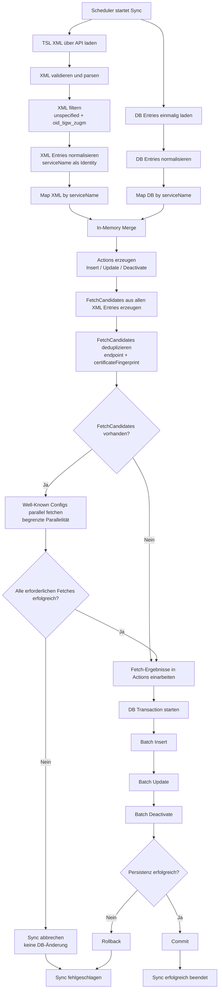
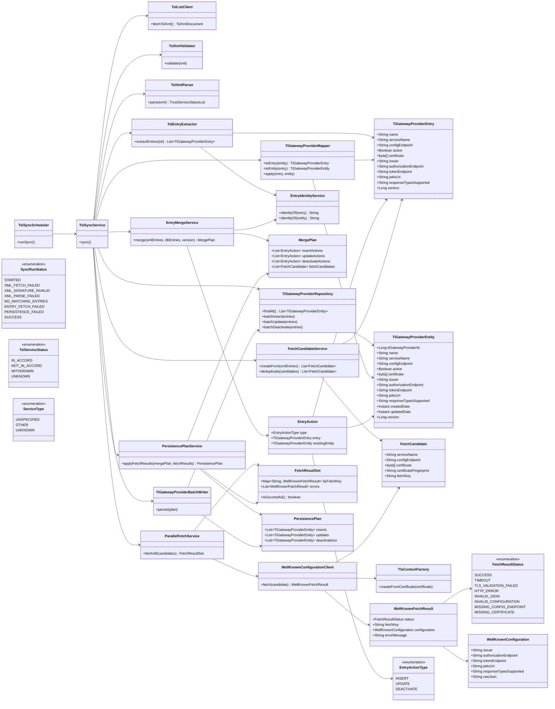

# Repository Guidelines

## Project Structure & Module Organization
This repository currently contains the Nix development environment in `flake.nix`, its lockfile in `flake.lock`, and the implementation brief in `task.md`. Keep application code under `src/main/java`, tests under `src/test/java`, and test data such as XML samples or OpenID configuration payloads under `src/test/resources`. If database migration files are added, place them in `src/main/resources/db/migration`.

## Build, Test, and Development Commands
Use the Nix shell first so Java, Gradle, MySQL, and formatting tools are consistent:

- `nix develop`: enter the pinned development shell with JDK 21 and Gradle.
- `nix fmt`: format `flake.nix` and other Nix files with `nixpkgs-fmt`.
- `gradle test`: run the unit and integration test suite.
- `gradle build`: compile, test, and assemble the application.
- `gradle run`: start the ingester locally once an application entry point exists.

## Coding Style & Naming Conventions
Use Java 21 and standard Gradle layout. Indent Java and Kotlin with 4 spaces; keep Nix files formatted by `nix fmt`. Use `PascalCase` for classes, `camelCase` for methods and fields, and lowercase package names such as `de.tsl.ingester.scheduler`. Prefer small service classes, explicit DTOs for parsed TSL/OpenID data, and constructor injection over static state.

## Testing Guidelines
Add robust automated tests for XML parsing, OpenID metadata fetching, database upserts, and deletion of removed providers. Prefer JUnit 5 and name test classes `*Test`; use `*IT` for database or network-adjacent integration tests. Keep fixtures deterministic and store sample TSL documents and `.well-known/openid-configuration` responses in `src/test/resources`.

## Commit & Pull Request Guidelines
The current history uses short, imperative commit subjects such as `add flake`. Continue that style and keep subjects under 72 characters. Each pull request should include a short problem statement, the chosen approach, test evidence (`gradle test` output), and screenshots only if a UI is introduced.

## Security & Configuration Tips
Do not commit real certificates, secrets, or production endpoints. Keep environment-specific values in local configuration or `.env`-style files excluded from Git, and use test certificates for TLS-related coverage.


# TI Gateway Provider TSL Sync – Implementierungsrichtlinien

## Ziel

Implementiere einen periodischen Sync-Prozess, der eine TSL-XML-Liste lädt, relevante TI-Gateway-Provider-Einträge extrahiert, zugehörige OpenID-Provider-Metadaten über `/.well-known/openid-configuration` nachlädt und den aktuellen Stand atomar in der bestehenden Tabelle `ti_gateway_provider` persistiert.

Der Prozess soll robust, batch-orientiert und parallelisiert für externe Well-Known-Fetches sein.

---

## Harte Constraints

### DB-Schema darf nicht verändert werden

Die bestehende Tabelle ist fix. Es dürfen keine Spalten hinzugefügt, entfernt oder geändert werden.

```sql
CREATE TABLE `ti_gateway_provider` (
  `ti_gateway_provider_id` bigint(11) unsigned NOT NULL AUTO_INCREMENT,
  `name` varchar(255) NOT NULL DEFAULT '',
  `service_name` varchar(255) NOT NULL DEFAULT '',
  `config_endpoint` varchar(255) DEFAULT NULL COMMENT 'ServiceSupplyPoint',
  `active` tinyint(1) DEFAULT NULL COMMENT 'http://uri.etsi.org/TrstSvc/Svcstatus/inaccord',
  `certificate` blob DEFAULT NULL,
  `issuer` varchar(255) DEFAULT NULL COMMENT 'ServiceSupplyPoint',
  `authorization_endpoint` varchar(255) DEFAULT NULL,
  `token_endpoint` varchar(255) DEFAULT NULL,
  `jwks_uri` varchar(255) DEFAULT NULL,
  `response_types_supported` varchar(255) DEFAULT NULL,
  `created_date` timestamp(6) NOT NULL DEFAULT current_timestamp(6),
  `updated_date` timestamp(6) NULL DEFAULT NULL ON UPDATE current_timestamp(6),
  `version` bigint(20) NOT NULL,
  PRIMARY KEY (`ti_gateway_provider_id`),
  UNIQUE KEY `service_name_idx` (`service_name`),
  KEY `active_idx` (`active`),
  KEY `version_idx` (`version`)
);
```

### fetch Entries:q


Der `.well-known/openid-configuration` Endpoint wird für alle aktuellen XML-Entries gefetcht.

### Fachlicher Identifikator

Da das DB-Schema keine eigene stabile technische Spalte enthält und `service_name` unique ist, ist `service_name` der fachliche Abgleichschlüssel.

```text
identity = service_name
```

Konsequenz:

```text
service_name in XML, nicht in DB
→ INSERT

service_name in XML und DB
→ UPDATE

service_name in DB, nicht in XML
→ DEACTIVATE
```

### Well-Known Fetch vor DB-Persistenz

Die OpenID-Konfigurationen müssen vor dem Schreiben in die DB geladen werden.

Die DB darf nur geschrieben werden, wenn alle erforderlichen Well-Known-Fetches erfolgreich waren.

### Keine Netzwerkcalls innerhalb der DB-Transaction

Netzwerkcalls passieren vor der DB-Transaction.

Die DB-Transaction startet erst, wenn der vollständige Persistenzplan bereitsteht.

### All-or-Nothing für DB-Update

Der finale DB-Schreibvorgang erfolgt atomar:

```text
Transaction starten
Batch Insert
Batch Update
Batch Deactivate
Commit
```

Wenn etwas beim Persistieren fehlschlägt:

```text
Rollback
```

---

## Relevante TSL-Filterbedingung

Aus der TSL werden nur solche `TrustServiceProvider` bzw. Services berücksichtigt, bei denen derselbe Service folgende Bedingungen erfüllt:

```text
ServiceTypeIdentifier == http://uri.etsi.org/TrstSvc/Svctype/unspecified
```

und mindestens eine Extension enthält:

```text
ExtensionValue == oid_tigw_zugm
```

Wichtig: Beide Bedingungen müssen am selben `TSPService` / derselben `ServiceInformation` erfüllt sein.

---

## Grober Ablauf

```text
1. Scheduler startet Sync
2. TSL XML über API laden
3. DB Entries einmalig laden
4. XML validieren und parsen
5. XML Liste filtern
6. XML Entries normalisieren
7. DB Entries normalisieren
8. Maps nach serviceName aufbauen
9. In-Memory Merge erzeugen
10. Actions erzeugen: INSERT / UPDATE / DEACTIVATE
11. FetchCandidates aus allen aktuellen XML Entries erzeugen
12. FetchCandidates deduplizieren
13. Well-Known Configs parallel fetchen
14. Fetch-Ergebnisse in Actions einarbeiten
15. DB Transaction starten
16. Batch Insert / Batch Update / Batch Deactivate
17. Commit oder Rollback
```

---

## Wichtiges Performance-Ziel

SQL-seitig keine N+1 Queries.

Stattdessen:

```text
1x SELECT aktueller DB-Stand
In-Memory Map by serviceName
1x Batch Insert
1x Batch Update
1x Batch Deactivate
```

HTTP-seitig:

```text
1x TSL Request
Mx deduplizierte Well-Known Requests
```

wobei:

```text
M <= Anzahl XML Entries
```

Deduplizierung der Well-Known-Fetches erfolgt über:

```text
fetchKey = normalizedConfigEndpoint + certificateFingerprint
```

---

## Mermaid Flowchart



---

## UML Klassendiagramm



---

## Domain-Modell

### `TiGatewayProviderEntry`

Fachliches Zwischenmodell. Nicht die JPA Entity.

Felder:

```text
name
serviceName
configEndpoint
active
certificate
issuer
authorizationEndpoint
tokenEndpoint
jwksUri
responseTypesSupported
version
```

Dieses Modell wird verwendet für:

```text
XML → Domain Entry
DB Entity → Domain Entry
Merge
FetchCandidate-Erzeugung
Persistenzplan
```

### `TiGatewayProviderEntity`

JPA-Abbildung der bestehenden Tabelle.

Darf nur die vorhandenen DB-Spalten enthalten.

### `EntryIdentityService`

Kapselt die fachliche Identität.

```text
identity = serviceName
```

Diese Entscheidung soll nicht verteilt im Code liegen.

---

## Enums

### `EntryActionType`

```text
INSERT
UPDATE
DEACTIVATE
```

### `FetchResultStatus`

```text
SUCCESS
TIMEOUT
TLS_VALIDATION_FAILED
HTTP_ERROR
INVALID_JSON
INVALID_CONFIGURATION
MISSING_CONFIG_ENDPOINT
MISSING_CERTIFICATE
```

### `SyncRunStatus`

```text
STARTED
XML_FETCH_FAILED
XML_SIGNATURE_INVALID
XML_PARSE_FAILED
NO_MATCHING_ENTRIES
ENTRY_FETCH_FAILED
PERSISTENCE_FAILED
SUCCESS
```

### `TslServiceStatus`

```text
IN_ACCORD
NOT_IN_ACCORD
WITHDRAWN
UNKNOWN
```

Internes Mapping von TSL-ServiceStatus-URIs.

DB-Feld:

```text
active = ServiceStatus == http://uri.etsi.org/TrstSvc/Svcstatus/inaccord
```

### `ServiceType`

```text
UNSPECIFIED
OTHER
UNKNOWN
```

Internes Mapping von ServiceTypeIdentifier-URIs.

Relevant:

```text
http://uri.etsi.org/TrstSvc/Svctype/unspecified
```

---

## Design Patterns / Architekturprinzipien

### Pipeline / Workflow

Der Sync ist eine klare Pipeline:

```text
Fetch XML
Validate XML
Parse XML
Filter XML
Load DB
Merge
Fetch Well-Known
Build Persistence Plan
Batch Persist
```

Der `TslSyncService` orchestriert diese Pipeline.

### Adapter Pattern

Externe Systeme werden gekapselt:

```text
TslListClient
WellKnownConfigurationClient
TiGatewayProviderRepository
```

Business-Logik soll nicht direkt HTTP, JAXB oder SQL sprechen.

### Mapper / Anti-Corruption Layer

XML-DTOs und JPA-Entities werden nicht direkt miteinander vermischt.

```text
JAXB DTO → TiGatewayProviderEntry
JPA Entity → TiGatewayProviderEntry
TiGatewayProviderEntry → JPA Entity
```

### Factory / Builder für normalisierte Entries

Normalisierung soll zentral erfolgen:

```text
trim
URL-Normalisierung
active aus ServiceStatus ableiten
certificate extrahieren
issuer setzen
```

### Unit of Work / Batch Writer

Persistenz erfolgt gesammelt:

```text
PersistencePlan
→ TiGatewayProviderBatchWriter.persist(plan)
```

Der Writer kapselt:

```text
DB Transaction
Batch Insert
Batch Update
Batch Deactivate
Commit/Rollback
```

### Bounded Concurrency / Worker Pool

Well-Known-Fetches laufen parallel, aber begrenzt.

Keine unkontrollierte Parallelität.

Wichtige Parameter:

```text
maxConcurrency
connectTimeout
readTimeout
maxResponseSize
```

---

## HTTP / TLS Anforderungen

### TSL XML Fetch

Die TSL XML wird über API geladen und danach validiert.

Validierung umfasst mindestens:

```text
XML-Signatur prüfen
TSL-Struktur prüfen
TSLSequenceNumber / Version bestimmen
```

### Well-Known Fetch

Für jeden aktuellen XML-Entry wird die OpenID-Konfiguration geladen:

```text
<config_endpoint>/.well-known/openid-configuration
```

TLS-Anforderung:

```text
Verwende das certificate aus dem Entry in einem TrustStore
für die einseitige TLS-Verbindung zum config_endpoint.
```

Bedeutung:

```text
Client validiert Server über das aus der TSL stammende Zertifikat.
Server validiert kein Client-Zertifikat.
```

### Well-Known Daten

Aus dem JSON werden mindestens übernommen:

```text
issuer
authorization_endpoint
token_endpoint
jwks_uri
response_types_supported
```

Diese Felder existieren in der DB-Tabelle.

---

## Merge-Regeln

### XML Entry nicht in DB

```text
INSERT
```

Der Entry wird inklusive Well-Known-Daten eingefügt.

### XML Entry in DB

```text
UPDATE
```

XML-Felder und Well-Known-Daten überschreiben den vorhandenen DB-Stand.

Die `version` wird auf die aktuelle Sync-/TSL-Version gesetzt.

### DB Entry nicht mehr in XML

```text
DEACTIVATE
```

Empfehlung:

```text
active = false
version = aktuelle Sync-/TSL-Version
```

Kein physisches Löschen.

---

## Fehlerverhalten

### Fehler vor DB-Transaction

Wenn einer der erforderlichen Schritte vor der DB-Transaction fehlschlägt:

```text
keine DB-Änderung
Sync fehlgeschlagen
```

Beispiele:

```text
TSL nicht ladbar
XML Signatur ungültig
XML nicht parsebar
Well-Known Fetch fehlgeschlagen
TLS Validierung fehlgeschlagen
JSON ungültig
```

### Fehler während DB-Transaction

```text
Rollback
Sync fehlgeschlagen
```

### Well-Known Fetch Fehler

Es gibt nur die strikte Policy:

```text
Wenn ein erforderlicher Well-Known-Fetch fehlschlägt,
wird der gesamte Sync abgebrochen.
Es wird nichts in die DB geschrieben.
```

---

## Implementierungshinweise

### Keine SQL N+1 Queries

Nicht:

```text
for each xmlEntry:
    SELECT * FROM ti_gateway_provider WHERE service_name = ?
```

Sondern:

```text
SELECT * FROM ti_gateway_provider
Map by serviceName
```

### Deduplizierung von FetchCandidates

Mehrere Entries können denselben Endpoint mit demselben Zertifikat verwenden.

Deshalb:

```text
fetchKey = normalizedConfigEndpoint + certificateFingerprint
```

Nur eindeutige FetchKeys werden tatsächlich gefetcht.

### FetchResult Mapping

Nach dem Fetch werden Ergebnisse anhand des `fetchKey` zurück auf die EntryActions gemappt.

### Version

Die Spalte `version` soll pro Sync-Lauf einheitlich gesetzt werden.

Empfohlen:

```text
version = TSLSequenceNumber
```

Wenn keine fachlich brauchbare TSLSequenceNumber verfügbar ist, kann eine intern erzeugte monotone Sync-Version verwendet werden.

---

## Nicht-Ziele

Nicht implementieren:

```text
contentHash
stable_key DB-Spalte
zusätzliche Statusspalten
physisches Löschen
N+1 SQL-Abfragen
Netzwerkcalls innerhalb der DB-Transaction
optionale/tolerante Fetch-Policy
```
