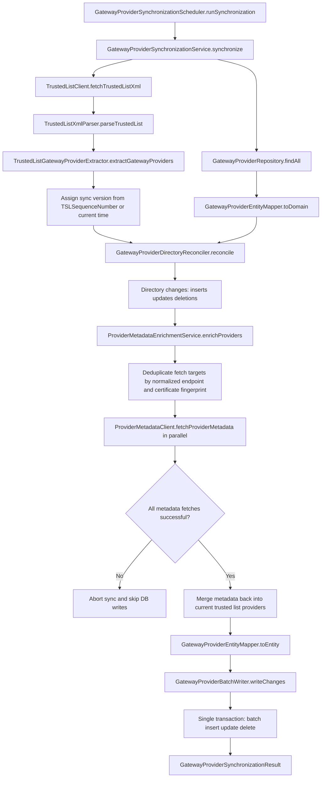
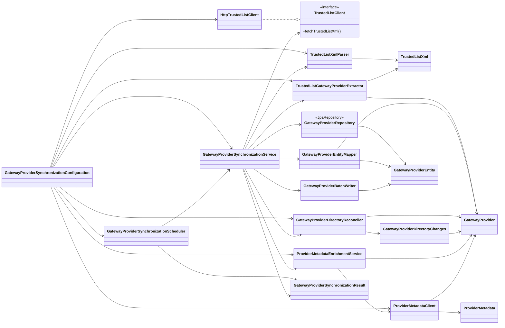

# Architecture Notes

## Sync pipeline

The application follows this synchronization pipeline:

1. `TrustedListClient` downloads the trusted list XML.
2. `TrustedListXmlParser` unmarshals the document into a JAXB trusted-list model and exposes the `TSLSequenceNumber`.
3. `TrustedListGatewayProviderExtractor` filters matching `TSPService` entries and maps them into the central domain model `GatewayProvider`.
4. `GatewayProviderRepository.findAll()` loads the current directory state once.
5. `GatewayProviderDirectoryReconciler` computes insert, update, and delete lists using `serviceName` as identity.
6. `ProviderMetadataEnrichmentService` deduplicates and fetches all required provider metadata before persistence.
7. `GatewayProviderBatchWriter` executes batch insert, batch update, and batch delete in one transaction.

## Sync flow diagram

## Package layout

- `de.tsl.ingester.config`
  Spring property binding and bean wiring.
- `de.tsl.ingester.gatewayprovider`
  Central domain model and gateway-provider persistence.
- `de.tsl.ingester.synchronization`
  Directory reconciliation, metadata enrichment orchestration, and scheduler.
- `de.tsl.ingester.trustedlist`
  Trusted-list HTTP client, JAXB parser, and gateway-provider extraction.
- `de.tsl.ingester.trustedlist.xml`
  JAXB DTOs for the relevant trusted-list subset.
- `de.tsl.ingester.providermetadata`
  TLS-backed provider-metadata client.

## Component structure diagram

## Persistence semantics

- `service_name` is the business key.
- current XML entry missing in DB: insert
- current XML entry present in DB: update
- DB entry missing in XML: delete

Deletion is implemented as a physical `DELETE` by `service_name`.

No network calls happen inside the DB transaction.

## Provider metadata handling

- every current XML entry must be enriched before persistence
- fetches are deduplicated by normalized endpoint and certificate fingerprint
- the TLS trust store is built from the TSL certificate bytes for the target endpoint
- any required fetch failure aborts the sync before persistence

## Current limitation

- XML signature validation is currently not implemented and should be added later as a dedicated adapter.

## Test strategy

- pure services are tested without Spring
- XML extraction is verified with fixture-driven tests
- HTTPS fetches are tested against a local `HttpsServer`
- batch persistence is tested with JDBC against an in-memory schema
